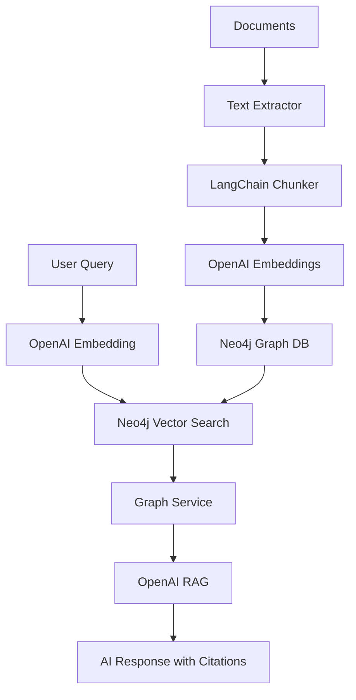

# ChatRAG Knowledge Graph

[](https://github.com/samowolabi/chatrag-knowledge-graph)
[](https://www.typescriptlang.org/)
[](https://neo4j.com/)
[](https://openai.com/)

🧠 **Intelligent RAG system with knowledge graphs.** Processes documents → extracts entities & relationships → stores in Neo4j → enables semantic search & AI-powered Q&A with citations.

A comprehensive **Retrieval-Augmented Generation (RAG)** system that ingests documents, creates knowledge graphs, and provides intelligent querying capabilities using OpenAI embeddings and Neo4j graph database.

## 🏗️ Architecture Overview

```
Documents → Ingestion Pipeline → Neo4j Graph → Query Pipeline → AI Responses
    ↓              ↓                ↓              ↓           ↓
   PDF/TXT    Text Extraction   Chunks +      Semantic    Generated
   Files      + Chunking       Entities +    Search +     Answers
                               Relations     Graph RAG    with Sources
```

## 📋 Table of Contents

- [Features](#-features)
- [Repository Structure](#-repository-structure)
- [System Architecture](#-system-architecture)
- [Prerequisites](#-prerequisites)
- [Installation](#-installation)
- [Configuration](#-configuration)
- [Data Ingestion Pipeline](#-data-ingestion-pipeline)
- [Query Pipeline](#-query-pipeline)
- [API Endpoints](#-api-endpoints)
- [Usage Examples](#-usage-examples)
- [Testing with Postman](#-testing-with-postman)
- [Architecture Details](#-architecture-details)
- [Troubleshooting](#-troubleshooting)

## ✨ Features

### 📊 Data Ingestion
- **Multi-format document parsing** (PDF, TXT, DOC)
- **Intelligent text chunking** using LangChain
- **OpenAI embeddings generation** for semantic search
- **Entity and relationship extraction** using AI
- **Neo4j graph storage** for complex relationships

### 🔍 Query System
- **Semantic search** using vector similarity
- **RAG (Retrieval-Augmented Generation)** with source citation
- **Graph traversal** for entity relationships
- **Hybrid search** combining semantic and keyword matching

## 📁 Repository Structure

```
chatrag-knowledge-graph/
├── src/
│   ├── config/
│   │   └── environment.ts          # Environment configuration
│   ├── controllers/
│   │   ├── ingestDataController.ts # Document ingestion endpoints
│   │   └── queryDataController.ts  # Query and search endpoints
│   ├── routes/
│   │   ├── graphRagRoutes.ts       # Ingestion API routes
│   │   └── queryRoutes.ts          # Query API routes
│   ├── services/
│   │   ├── graphService.ts         # Neo4j graph operations
│   │   ├── langchainService.ts     # Text chunking with LangChain
│   │   ├── neo4jService.ts         # Neo4j database connection
│   │   ├── openaiService.ts        # OpenAI API integration
│   │   └── textExtractor.ts        # Document parsing (PDF/TXT)
│   ├── utils/
│   │   ├── chunkText.ts           # Text processing utilities
│   │   └── jsonToObjectParser.ts  # JSON parsing utilities
│   └── index.ts                   # Express server entry point
├── ChatRAG API.postman_collection.json  # Postman test collection
├── package.json                   # Dependencies and scripts
├── tsconfig.json                 # TypeScript configuration
├── nodemon.json                  # Development server config
└── README.md                     # This file
```

## 🏗️ System Architecture

### High-Level Architecture



### Component Architecture

```
┌─────────────────────────────────────────────────────────────────┐
│                        Express.js Server                        │
├─────────────────────────────────────────────────────────────────┤
│                          Routes Layer                           │
│  ┌─────────────────────┐    ┌─────────────────────────────────┐ │
│  │   graphRagRoutes    │    │        queryRoutes              │ │
│  │   (Ingestion)       │    │       (Search & RAG)           │ │
│  └─────────────────────┘    └─────────────────────────────────┘ │
├─────────────────────────────────────────────────────────────────┤
│                       Controllers Layer                         │
│  ┌─────────────────────┐    ┌─────────────────────────────────┐ │
│  │ ingestDataController│    │   queryDataController          │ │
│  │ • extractText       │    │   • semanticSearch             │ │
│  │ • breakTextIntoChunks│   │   • ragQuery                   │ │
│  │ • generateEmbeddings│    │   • (future: hybridSearch)     │ │
│  │ • storeInGraph      │    │                                │ │
│  │ • fullPipeline      │    │                                │ │
│  └─────────────────────┘    └─────────────────────────────────┘ │
├─────────────────────────────────────────────────────────────────┤
│                        Services Layer                           │
│  ┌──────────────┐ ┌──────────────┐ ┌──────────────┐ ┌─────────┐ │
│  │ textExtractor│ │langchainSvc  │ │ openaiService│ │graphSvc │ │
│  │ • parsePDF   │ │ • splitText  │ │ • embedText  │ │• search │ │
│  │ • parseTXT   │ │ • chunkText  │ │ • chatCompl  │ │• store  │ │
│  │ • parseDoc   │ │              │ │ • embedBatch │ │• entity │ │
│  └──────────────┘ └──────────────┘ └──────────────┘ └─────────┘ │
│                              ┌──────────────┐                   │
│                              │ neo4jService │                   │
│                              │ • connection │                   │
│                              │ • queries    │                   │
│                              │ • transactions│                  │
│                              └──────────────┘                   │
├─────────────────────────────────────────────────────────────────┤
│                         Data Layer                              │
│              ┌─────────────────────────────────────┐            │
│              │           Neo4j Graph Database       │            │
│              │  ┌─────────────┐  ┌─────────────────┐│            │
│              │  │   Chunks    │  │    Entities     ││            │
│              │  │ • content   │  │ • name/type     ││            │
│              │  │ • embedding │  │ • description   ││            │
│              │  │ • metadata  │  │ • properties    ││            │
│              │  └─────────────┘  └─────────────────┘│            │
│              │           Relationships              │            │
│              │         • CONTAINS                   │            │
│              │         • RELATES_TO                 │            │
│              │         • Custom types               │            │
│              └─────────────────────────────────────┘            │
└─────────────────────────────────────────────────────────────────┘
```

### Service Responsibilities

| Service | Purpose | Key Methods |
|---------|---------|-------------|
| **textExtractor** | Document parsing | `parseDocument()`, `extractMetadata()` |
| **langchainService** | Text processing | `splitText()`, `createChunks()` |
| **openaiService** | AI operations | `embedText()`, `chatCompletion()`, `embedTextsBatch()` |
| **neo4jService** | Database layer | `executeQuery()`, `initialize()`, `testConnection()` |
| **graphService** | Graph operations | `semanticSearchChunks()`, `storeExtractedNodesAndRelationships()` |

## 🛠️ Prerequisites

- **Node.js** 18+
- **Neo4j Database** 4.0+ (with optional GDS library)
- **OpenAI API Key**
- **TypeScript** knowledge

## 📦 Installation

```bash
# Clone the repository
git clone <repository-url>
cd chatrag-app

# Install dependencies
npm install

# Set up environment variables
cp .env.example .env
```

## ⚙️ Configuration

Create a `.env` file with the following variables:

```env
# Server Configuration
PORT=3000

# OpenAI Configuration
OPENAI_API_KEY=your_openai_api_key_here

# Neo4j Configuration
NEO4J_URI=neo4j://localhost:7687
NEO4J_USERNAME=neo4j
NEO4J_PASSWORD=your_neo4j_password

# Optional: Neo4j AuraDB (cloud)
# NEO4J_URI=neo4j+s://your-instance.databases.neo4j.io
```

## 📥 Data Ingestion Pipeline

The ingestion system processes documents through multiple stages:

### Pipeline Stages

1. **Text Extraction** → Parse documents into structured text
2. **Text Chunking** → Split content into manageable pieces
3. **Embedding Generation** → Create vector representations
4. **Chunk Storage** → Save chunks with embeddings to Neo4j
5. **Entity Extraction** → Identify entities and relationships using AI
6. **Graph Construction** → Store entities and relationships in Neo4j

### Available Endpoints

| Endpoint | Method | Description |
|----------|--------|-------------|
| `/graphrag/extract-text` | POST | Parse documents (PDF/TXT/DOC) |
| `/graphrag/break-text` | POST | Split text into chunks |
| `/graphrag/embed-chunks-with-openai` | POST | Generate embeddings |
| `/graphrag/store-chunks-embeddings-graph` | POST | Store chunks in Neo4j |
| `/graphrag/extract-document-nodes-relationships-graph` | POST | Extract entities/relationships |
| `/graphrag/store-extracted-nodes-relationships-graph` | POST | Store graph data |
| `/graphrag/process-document-pipeline` | POST | **Full end-to-end processing** |

### Individual Steps Usage

#### 1. Extract Text from Document
```bash
curl -X POST http://localhost:3000/graphrag/extract-text \
  -H "Content-Type: application/json" \
  -d '{
    "filePath": "/path/to/document.pdf",
    "type": "pdf"
  }'
```

#### 2. Break Text into Chunks
```bash
curl -X POST http://localhost:3000/graphrag/break-text \
  -H "Content-Type: application/json" \
  -d '{
    "text": "Your document content here..."
  }'
```

#### 3. Generate Embeddings
```bash
curl -X POST http://localhost:3000/graphrag/embed-chunks-with-openai \
  -H "Content-Type: application/json" \
  -d '{
    "chunks": [
      {"id": "chunk_1", "content": "First chunk content"},
      {"id": "chunk_2", "content": "Second chunk content"}
    ]
  }'
```

#### 4. Store Chunks with Embeddings
```bash
curl -X POST http://localhost:3000/graphrag/store-chunks-embeddings-graph \
  -H "Content-Type: application/json" \
  -d '{
    "chunks": [
      {
        "id": "chunk_1",
        "content": "Content here",
        "embedding": [0.1, 0.2, 0.3, ...]
      }
    ]
  }'
```

#### 5. Full Pipeline (Recommended)
```bash
curl -X POST http://localhost:3000/graphrag/process-document-pipeline \
  -H "Content-Type: application/json" \
  -d '{
    "filePath": "/path/to/document.pdf",
    "type": "pdf"
  }'
```

## 🔍 Query Pipeline

The query system provides multiple ways to retrieve and generate responses:

### Available Query Types

| Endpoint | Method | Purpose |
|----------|--------|---------|
| `/query/semantic` | POST | Vector similarity search |
| `/query/rag` | POST | AI-generated answers with sources |

### Query Examples

#### Semantic Search
Find similar content using vector embeddings:

```bash
curl -X POST http://localhost:3000/query/semantic \
  -H "Content-Type: application/json" \
  -d '{
    "query": "artificial intelligence applications",
    "limit": 5
  }'
```

**Response:**
```json
{
  "success": true,
  "data": {
    "query": "artificial intelligence applications",
    "results": [
      {
        "id": "chunk_1",
        "content": "AI applications in healthcare include...",
        "similarity": 0.89,
        "score": 0.89
      }
    ],
    "count": 5
  }
}
```

#### RAG Query
Get AI-generated answers with source citations:

```bash
curl -X POST http://localhost:3000/query/rag \
  -H "Content-Type: application/json" \
  -d '{
    "query": "What are the benefits of machine learning?",
    "limit": 3,
    "includeContext": true
  }'
```

**Response:**
```json
{
  "success": true,
  "data": {
    "query": "What are the benefits of machine learning?",
    "answer": "Based on the provided context, machine learning offers several key benefits [1][2]: automation of complex tasks, pattern recognition in large datasets...",
    "sources": [
      {
        "id": "chunk_1",
        "content": "Machine learning enables automated...",
        "similarity": 0.92,
        "sourceNumber": 1
      }
    ],
    "metadata": {
      "chunksRetrieved": 3,
      "avgSimilarity": 0.87
    }
  }
}
```

## 🚀 Quick Start

### 1. Start the Server
```bash
npm run dev
```

### 2. Ingest Your First Document
```bash
curl -X POST http://localhost:3000/graphrag/process-document-pipeline \
  -H "Content-Type: application/json" \
  -d '{
    "filePath": "/path/to/your/document.pdf",
    "type": "pdf"
  }'
```

### 3. Query Your Data
```bash
curl -X POST http://localhost:3000/query/rag \
  -H "Content-Type: application/json" \
  -d '{
    "query": "What is this document about?",
    "limit": 5
  }'
```

## 📊 Neo4j Graph Schema

### Node Types
- **Chunk**: Document fragments with embeddings
- **Entity**: Extracted entities (PERSON, ORGANIZATION, LOCATION, CONCEPT)

### Relationship Types
- **CONTAINS**: Document contains entities
- **RELATES**: Entity relationships
- **Custom types**: Based on extracted relationships

### Example Cypher Queries
```cypher
// View all chunks
MATCH (c:Chunk) RETURN c LIMIT 10

// Find entities of a specific type
MATCH (e:PERSON) RETURN e.name, e.description

// Explore relationships
MATCH (a)-[r]->(b) RETURN a.name, type(r), b.name LIMIT 10
```

## 🧪 Testing with Postman

### Import Collection
1. **Download**: [`ChatRAG API.postman_collection.json`](./ChatRAG%20API.postman_collection.json)
2. **Import to Postman**: File → Import → Upload the JSON file
3. **Set Environment**: Update `base_url` variable to `http://localhost:3000`

### Available Test Collections

The Postman collection includes comprehensive tests for:

#### **📥 Ingestion Endpoints**
- ✅ Health Check
- ✅ Extract Text from Document  
- ✅ Break Text into Chunks
- ✅ Generate Embeddings
- ✅ Store Chunks & Embeddings
- ✅ Extract Entities & Relationships
- ✅ Store Graph Data
- ✅ **Full Pipeline Test** (End-to-end)

#### **🔍 Query Endpoints**
- ✅ Semantic Search
- ✅ RAG Query with Citations
- ✅ (Future: Hybrid Search, Entity Search)

### Test Sequence
1. **Health Check** → Verify server is running
2. **Full Pipeline** → Process a sample document
3. **Semantic Search** → Test vector search
4. **RAG Query** → Test AI response generation

### Sample Test Data Included
- Realistic document content examples
- Pre-configured embeddings for testing
- Entity/relationship samples
- Various query examples

## 🔧 Architecture Details

### Request/Response Flow

#### Ingestion Flow
```
1. POST /graphrag/process-document-pipeline
   ↓
2. ingestDataController.processDocumentPipeline()
   ↓
3. textExtractor.parseDocument() → Document object
   ↓
4. langchainService.splitText() → Text chunks
   ↓
5. openaiService.embedTextsBatch() → Vector embeddings
   ↓
6. graphService.storeBatchChunksWithEmbeddings() → Neo4j storage
   ↓
7. graphService.extractEntitiesAndRelationshipsFromText() → AI extraction
   ↓
8. graphService.storeExtractedNodesAndRelationships() → Graph relationships
```

#### Query Flow
```
1. POST /query/rag
   ↓
2. queryDataController.ragQuery()
   ↓
3. openaiService.embedText() → Query embedding
   ↓
4. graphService.semanticSearchChunks() → Similar chunks
   ↓
5. Build context from retrieved chunks
   ↓
6. openaiService.chatCompletion() → AI response
   ↓
7. Return answer with source citations
```

### Core Services

#### TextExtractor Service
- **Purpose**: Multi-format document parsing
- **Formats**: PDF, TXT, DOC files
- **Methods**: 
  - `parseDocument(filePath, type)` - Main parsing method
  - `extractMetadata()` - Document metadata extraction
- **Dependencies**: pdf-parse, fs

#### LangChain Service
- **Purpose**: Intelligent text chunking
- **Features**: Configurable chunk size, overlap handling
- **Methods**:
  - `splitText(text)` - Split text into chunks
  - `createChunks()` - Create chunk objects with IDs
- **Dependencies**: LangChain TextSplitter

#### OpenAI Service
- **Purpose**: AI operations and embeddings
- **Models**: text-embedding-ada-002, gpt-4
- **Methods**:
  - `embedText(text)` - Single text embedding
  - `embedTextsBatch(texts[])` - Batch embedding processing
  - `chatCompletion(messages, options)` - AI response generation
- **Features**: Automatic retry, error handling, batch optimization

#### Neo4j Service
- **Purpose**: Database connection and query execution
- **Features**: Connection pooling, transaction management
- **Methods**:
  - `initialize()` - Database setup
  - `executeQuery(query, params)` - Query execution
  - `testConnection()` - Health check
- **Configuration**: Supports local and AuraDB cloud instances

#### Graph Service
- **Purpose**: High-level graph operations
- **Features**: Vector search, entity management, relationship handling
- **Methods**:
  - `semanticSearchChunks(embedding, limit)` - Vector similarity search
  - `storeExtractedNodesAndRelationships()` - Graph data storage
  - `extractEntitiesAndRelationshipsFromText()` - AI-powered extraction
- **Fallbacks**: Manual cosine similarity if GDS not available

### Data Models

#### Chunk Model
```typescript
interface Chunk {
  id: string;
  content: string;
  embedding: number[];
  metadata: Record<string, any>;
}
```

#### Entity Model
```typescript
interface GraphEntity {
  id: string;
  name: string;
  type: string; // PERSON, ORGANIZATION, LOCATION, CONCEPT
  description: string;
  properties: Record<string, any>;
}
```

#### Relationship Model
```typescript
interface GraphRelationship {
  id: string;
  source: string;
  target: string;
  type: string; // RELATES_TO, WORKS_FOR, etc.
  description: string;
  properties: Record<string, any>;
}
```

## 🐛 Troubleshooting

### Common Issues

#### Neo4j Connection Failed
```bash
# Check Neo4j status
neo4j status

# Start Neo4j
neo4j start

# Verify credentials in .env file
```

#### OpenAI API Errors
```bash
# Verify API key
echo $OPENAI_API_KEY

# Check API quota and billing
```

#### Vector Search Issues
If GDS functions fail, the system automatically falls back to manual cosine similarity calculation.

#### Memory Issues with Large Documents
- Reduce chunk size in LangChain configuration
- Process documents in smaller batches
- Increase Node.js memory limit: `node --max-old-space-size=4096`

### Debug Mode
```bash
# Enable detailed logging
DEBUG=* npm run dev
```

### Health Check
```bash
curl http://localhost:3000/
```

## 📈 Performance Optimization

### Neo4j Optimization
```cypher
// Create vector index for faster similarity search
CREATE VECTOR INDEX chunk_embeddings FOR (c:Chunk) ON (c.embedding)
OPTIONS {indexConfig: {`vector.dimensions`: 1536, `vector.similarity_function`: 'cosine'}}

// Create text index for keyword search
CREATE TEXT INDEX chunk_content FOR (c:Chunk) ON (c.content)
```

### Batch Processing
- Process documents in batches of 10-50 chunks
- Use Promise.all for parallel embedding generation
- Implement pagination for large query results

## 🤝 Contributing

### Development Setup
```bash
# Clone the repository
git clone https://github.com/samowolabi/chatrag-knowledge-graph.git
cd chatrag-knowledge-graph

# Install dependencies
npm install

# Set up environment
cp .env.example .env

# Start development server
npm run dev
```

### Adding New Features

#### Adding New Query Types
1. Implement controller in `src/controllers/queryDataController.ts`
2. Add route in `src/routes/queryRoutes.ts`
3. Update Postman collection
4. Update this README

#### Adding New Document Types
1. Extend `textExtractor` service in `src/services/textExtractor.ts`
2. Update type definitions
3. Test with sample documents
4. Add tests to Postman collection

#### Adding New Services
1. Create service file in `src/services/`
2. Implement proper error handling
3. Add to dependency injection in controllers
4. Document in README architecture section

### Code Style
- TypeScript strict mode
- Async/await pattern
- Proper error handling with try/catch
- Descriptive variable and function names
- JSDoc comments for public methods

### Pull Request Process
1. Fork the repository
2. Create a feature branch (`git checkout -b feature/amazing-feature`)
3. Implement changes with proper testing
4. Update documentation (README, Postman collection)
5. Commit changes (`git commit -m 'Add amazing feature'`)
6. Push to branch (`git push origin feature/amazing-feature`)
7. Open a Pull Request

## 📄 License

This project is licensed under the ISC License - see the [LICENSE](LICENSE) file for details.

## 🙏 Acknowledgments

- **OpenAI** for powerful embeddings and language models
- **Neo4j** for graph database capabilities  
- **LangChain** for text processing utilities
- **TypeScript** community for excellent tooling

---

**Repository**: [https://github.com/samowolabi/chatrag-knowledge-graph](https://github.com/samowolabi/chatrag-knowledge-graph)

**Happy querying! 🚀**

For support, please check the [troubleshooting section](#-troubleshooting) or create an issue in the repository.# chatrag-knowledge-graph
